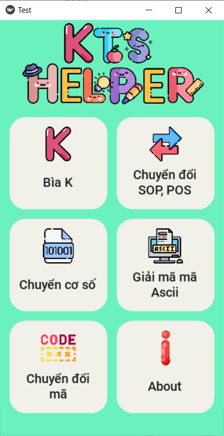
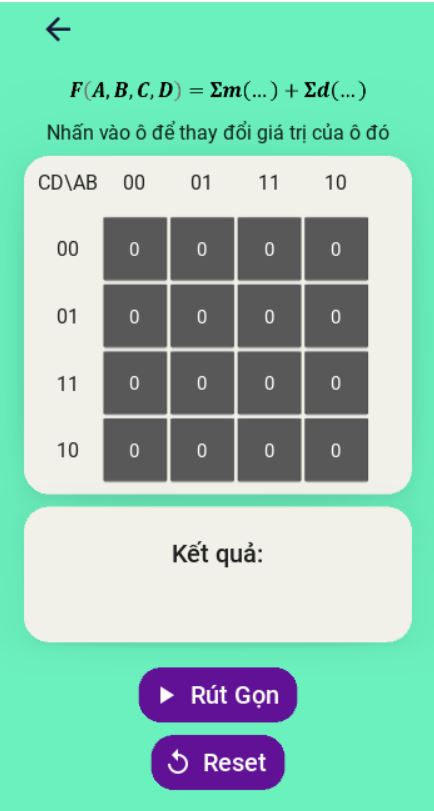

Ky Thuat So Helper

Purpose: Help University students learn Digital Electronics
Karnaugh 2,3,4 variables - Convert base - Convert Ascii - SOP to POS and vice versa - BCD, Gray, 2421, Excess-3

Language: Python (3.7) and Kivy

Student project at Ho Chi Minh City University of Technology

